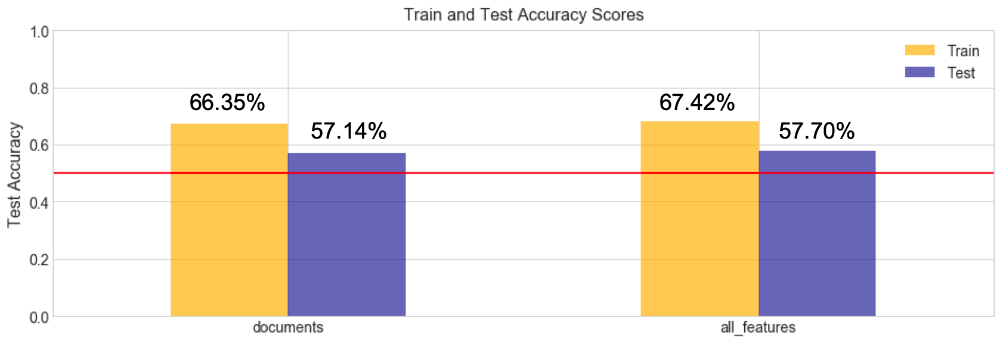
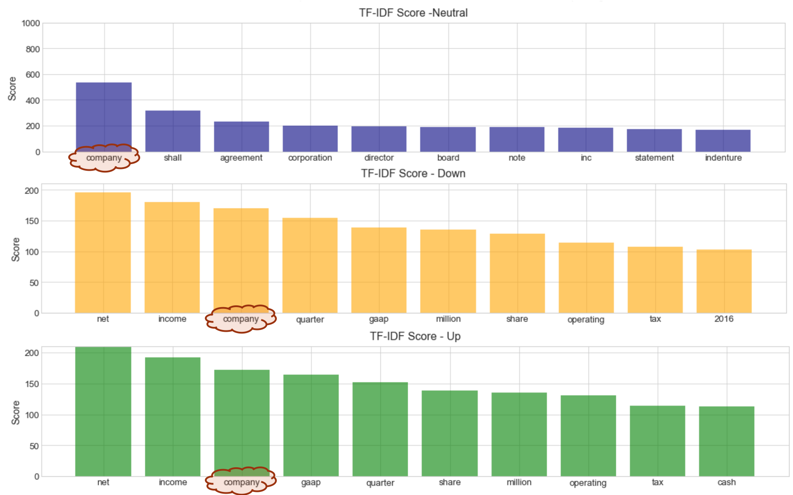
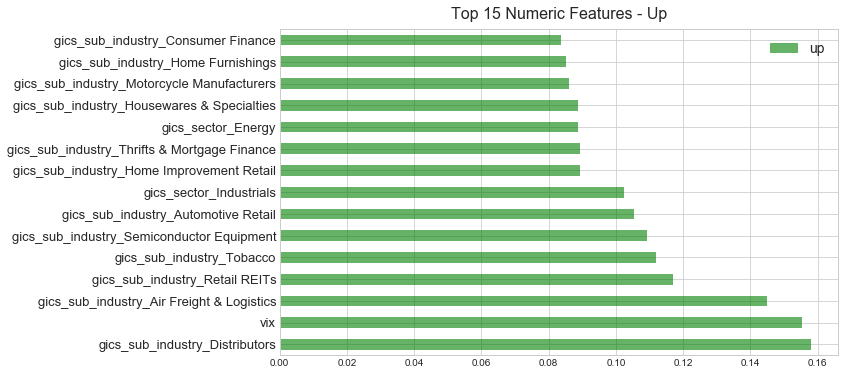
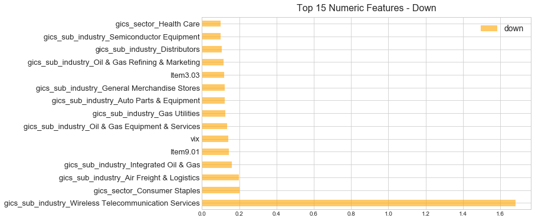

## General Assembly DSI 9 - Gabriel Perez Prieto
## Capstone Project - Stock Price Movements

### Problem Statement
---
Is it possible to predict stock movements based the 8-K SEC filing - Using Natural Language Processing ?

This work has been developed to due to my personal interest in the Stock Market and Investments.

Despite the main idea of the project being to test the hypothesis of predicting stock movements based
on 8-K filings, this could be used by Banks, Hedge Funds, Wealth Management Firms and Individual Investors
as a tool for short-term trades.

The Form 8-K is the “current report” companies must file with the SEC to announce major events that
shareholders should know about.

According to the Efficient Market Hypothesis, stock prices reflect all available information and so
filings release dates were used to calculate the percentage change on the stock price after companies
announce major changes.

### Data Collections
---
The analysis was done on all companies in the S&P 500 and information on companies such as sector and
sub-industry was collected by scraping the Wikipedia page for the index.

As a next step, the SEC Edgar website was scraped to gather the full text file for each 8-K form
companies have filed from Jan-2011 to Sep-2019 and all the text was concatenated and release dates with
the timestamp were extracted for each individual filing. Over 63,000 documents were retrieved from the database.

With the information on the release date, a percentage change was calculated based on the next opening/closing
of the market, depending on the filing's release time, for each filing and normalized by the percentage
change on the SP&500 - This guarantees that we work with the true gain/loss in stock prices after each
document was filed. All the data for the stock prices were downloaded from Yahoo Finance.

Documents with normalized percentage changes that were:
- Over 1% were classified as 'Up'
- Under -1% were classified as 'Down'
- Anything in between -1% and 1% was classified as 'Neutral'

After parsing all documents, deleting duplicates and removing files that we not usable for any reason I ended
up with almost 57,000 documents to be analyzed.

### Feature Engineering
---
Regarding the features that were used in the model to help on predicting the movements were:
- Item types of events that trigger a public company's obligation to file a current report [Learn More](https://www.sec.gov/fast-answers/answersform8khtm.html)
- Historical Returns for a week, month, quarter and year prior to the release date
- Sector and Sub-Industry
- Volatility of the Market on the release date (VIX)

### Preprocessing
---
The text preprocessing was done by removing english stop words and punctuation as well as lemmatizing the words.
Due to unbalanced classes (68.24% - Neutral) a Random OverSampler was used on training data to prevent model bias
to the majority class.

### Modeling
---
The technique used to model the problems was a Pipeline with a ColumnTransformer to used both categorical and
numerical features and Randomized Search to tune the model.

TF-IDF (Term Frequency - Inverse Document Frequency) was used to vectorize the text data and Variables such as
Sector, Sub-Industry and Items were dummied with the GetDummies method or a Multi label Binarizer.
All numerical features were transformed with the Standard Scaler.

The classifier chosen to do the analysis was a Logistic Regression for its interpretability.

### Conclusion
---
The Accuracy results for model with only the text documents and including all previously mentioned features
can be seen in the following image:

Not a great improvement was observed on the model with all extra features besides the text in comparison with
the single feature model.

On the other hand, 57% accuracy score on the testing data is a 73% improvement on a baseline random choice model.

Regarding Feature importance, for documents classified as having an Uptrend or a Downtrend the most common words
appear to be roughly the same as can be seen in the image below.

Among the the extra features included in the model the most important features seem to be the Sub Industries in
which companies are operating under as well as a few specific types of current reports. The following images summarize
the most important features for the Uptrend and Downtrend classes of the model.

For the Uptrend label one of the most important features is the Volatility of the Market alongside with previously
mentioned Sub-Industries.

Regarding the Downtrend label a couple of the Item Sections show up as being a good predictor of a down movement on
the stock price after the release of the documents.

Item 9.01 - Financial Statements and Exhibits
Item 3.03 - Modification to Rights of Shareholders

Given those results it is worth creating models for specific industries as documents seem to be general
to the whole market and sub-industries are considered good predictors of stock movements. By creating models
per industry results usually improve in at least a couple percentage points for certain industries.

As some final thoughts I would say that it is possible to get an edge on short-term trades if provided with
the right tools and so models like this one could be be used to make quick trading decisions.

### Next Steps
---
This analysis only touches the surface on the topic and it does not use the latest and most advanced techniques for
Natural Language Processing. Therefore some of the future steps for this work might be to:

- Develop a convolutional and recurrent neural network model with a specialized word embedding layer
- Use Sense2Vec to understand sentences and extract more information from the text
- Create a time series model that could be integrated to make a stronger prediction

Other sources of information could also be explored:
- Macroeconomic information such as the short and long term interest rates
- Sentiment analysis
- News and Twitter posts that might also influence the stock market behavior
